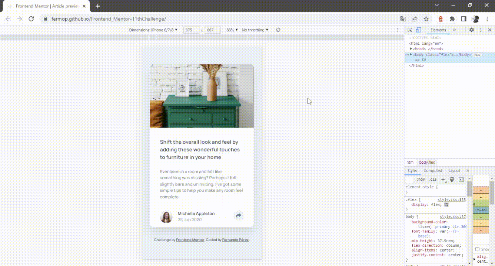
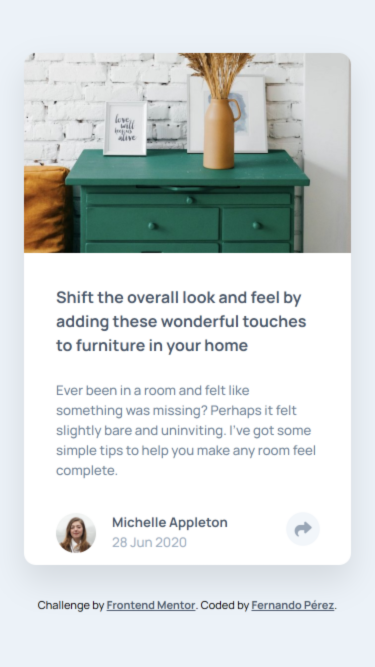

# Frontend Mentor - Article preview component solution

This is a solution to the [Article preview component challenge on Frontend Mentor](https://www.frontendmentor.io/challenges/article-preview-component-dYBN_pYFT). Frontend Mentor challenges help you improve your coding skills by building realistic projects. 

## Table of contents

- [Overview](#overview)
  - [The challenge](#the-challenge)
  - [Screenshot](#screenshot)
  - [Links](#links)
- [My process](#my-process)
  - [Built with](#built-with)
  - [Useful resources](#useful-resources)
- [Author](#author)

## Overview

### The challenge

Users should be able to:

- View the optimal layout for the component depending on their device's screen size
- See the social media share links when they click the share icon

### Screenshot

📱 Mobile

💻 Desktop

### Links

- Solution URL: [https://www.frontendmentor.io/solutions/article-preview-component-hDwRJD7ZeD](https://www.frontendmentor.io/solutions/article-preview-component-hDwRJD7ZeD)
- Live Site Here: [https://fermop.github.io/Frontend_Mentor-11thChallenge/](https://fermop.github.io/Frontend_Mentor-11thChallenge/)

## My process

### Built with

- Semantic HTML5 markup
- CSS custom properties
  - Flexbox
- JavaScript
- Mobile-first workflow
- BEM naming convention

### Useful resources

- [BEM](https://9elements.com/bem-cheat-sheet/) - This helps me to know where exactly I'm working on so I don't have to create classes with some weird names haha.
- [Josh Comeau’s CSS reset](https://www.joshwcomeau.com/css/custom-css-reset/) - This reset makes browsers render all elements more consistently and in line with modern standards. It precisely targets only the styles that need to be reset.

## Author

- Frontend Mentor - [@fermop](https://www.frontendmentor.io/profile/fermop)
- Instagram - [fermop_](https://www.instagram.com/fermop_/)
- Facebook - [Fernando Mojica](https://www.facebook.com/fernando.mojica.758737/)